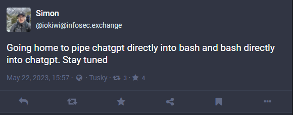

# ChatACE

**ACE** = **A**rbitrary **C**ode **E**xecution

<a href="https://infosec.exchange/@iokiwi/110410325022308903/">


</a>

## Usage

1. Clone the repo
2. Install the dependencies

    ```bash
    pip install -r requirements.txt
    ```
3. Get open ai api credentials
   * Find your organization ID (https://platform.openai.com/account/org-settings)
   * Create an API key (https://platform.openai.com/account/api-keys)
4. Create a `.env` file at the route of the directory with the following variables
    ```bash
    OPENAI_API_KEY="<your openai api key>"
    OPENAI_ORGANIZATION="<your organization id>"
    ```
3. Invoke the script
    ```bash
    python main.py "<state your objective>"
    ```
4. Sit back while AI does the rest.
    

## Disclaimer ⚠️

If you got this far and haven't realised yet, this script is a shitpost and is very stupid and unsafe. It ~~includes~~ is nothing more than [arbitrary code execution](https://en.wikipedia.org/wiki/Arbitrary_code_execution)

Do not run it anywhere near data you value. Use a docker container, or virtual machine or a raspberry pi or a virtual private server. I take no responsibility for data loss or damages. Don't be stupid.

## Docker file

Work in progress. Plan is to make it the default and a convenient way to play with the concept while somewhat limit the blast radius*

*Although one of the things I want to try is container escapes.

### Build
```bash
docker build . -t chatace:latest
```

### Run
```bash
docker run --env-file .env chatace:latest
```

### Development

```bash
docker run -it \
    --env-file .env \
    --entrypoint /bin/sh \
    -v $(pwd)/main.py:/main.py \
    chatace:latest
```

## TODO

 * [ ] I want to literally be able to pipe to chatgpt
 * [ ] Maybe conver to a pure shell implementation