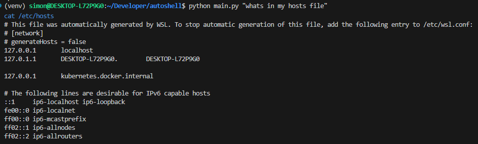

# ChatACE

**ACE** = **A**rbitrary **C**ode **E**xecution

<a href="https://infosec.exchange/@iokiwi/110410325022308903/">


</a>

### Usage

1. Clone the repo

2. Install the dependencies

    ```bash
    pip install -r requirements.txt
    ```

3. Invoke the script

    ```bash
    python main.py "<state your objective>"
    ```

4. Sit back while AI does the rest.
    

### Disclaimer

>⚠️ If you got this far and haven't realised yet, this script is a shitpost and is very stupid and unsafe. It ~~includes~~ is nothing more than [arbitrary code execution](https://en.wikipedia.org/wiki/Arbitrary_code_execution) by design. Do not run it anywhere near data you value. Use a docker container, or virtual machine or a raspberry pi or a disposable vps. I take no responsibility for data loss or damages. Don't be stupid.

### Docker file

Work in progress. Plan is to make it the default and a convenient way to play with the concept while somewhat limit the blast radius*

*Although one of the things I want to try is container escapes.

### TODO

 * [ ] I want to literally be able to pipe to chatgpt
 * [ ] Maybe conver to a pure shell implementation